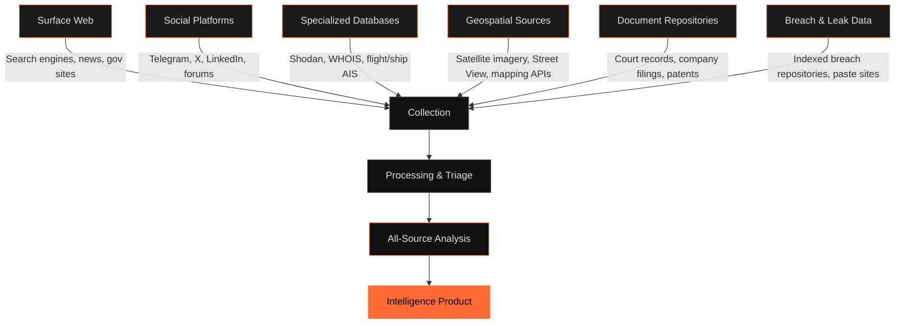
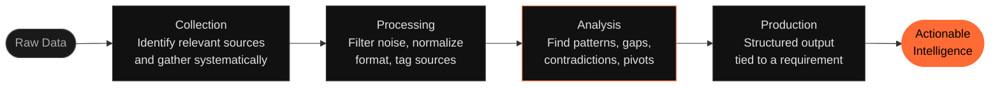
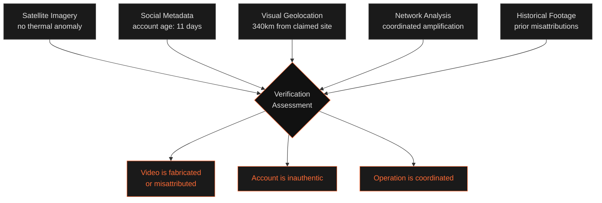

# What is OSINT

The textbook definition is useless. "Information collected from publicly available sources" describes everything from reading a newspaper to running automated infrastructure scans. It tells you nothing about how OSINT actually works or why it matters.

Here's a better framing: OSINT is the discipline of turning fragmented, publicly accessible data into structured, actionable intelligence — under time pressure, without burning sources, and with enough rigor that your conclusions can be defended.

That's the job.

---

## Watch It Happen in Real Time

A video surfaces on Telegram at 03:17 UTC. Forty seconds of shaky footage. Someone claims it shows a strike on a fuel depot in a conflict zone. The post gets 4,000 shares in under an hour.

The video might be real. It might be six months old. It might be from a different country entirely. You have no way to know — yet.

By 05:40 UTC, a team working open sources has established the following:

The location is not what the post claims. A rooftop water tank visible at 0:23, a distinctive antenna cluster, and the angle of a highway interchange place the footage in a city 340 kilometers from where the caption says it occurred. Google Earth imagery confirms the intersection. Sentinel-2 satellite data from the same week shows no thermal anomaly at the claimed site. There was no strike.

The original account posting the video was created 11 days ago. Its prior posts are a mix of legitimate conflict footage and two other videos later identified as misattributed. The account shows coordinated amplification patterns — dozens of repost accounts active within minutes of each post, several sharing the same profile photo metadata fingerprint.

This is OSINT. Not a single piece of that analysis required a paid database, a leaked file, or a source inside any organization. It required knowing where to look, what to look for, and how to connect what you find.

---

## What "Open Source" Actually Covers

The word "open" is misleading. It implies easy, obvious, freely given. Most useful OSINT data is technically public but practically obscure — buried in corporate registries, embedded in image metadata, indexed in breach repositories, logged in passive DNS records, or visible only if you know the right satellite pass time.

The sources that require the most skill to exploit are rarely the exotic ones. A corporate WHOIS record or a shipping manifest can break an investigation that months of social media monitoring couldn't. The discipline is knowing which layer of the source hierarchy to hit first for a given question.

---

## From Raw Data to Intelligence

Data is not intelligence. A list of IP addresses is not intelligence. A folder of screenshots is not intelligence. Intelligence is data that has been collected, evaluated for reliability, processed for meaning, and analyzed in context — then communicated in a form that supports a decision.

The gap between collection and production is where most OSINT efforts fail. Analysts collect aggressively and analyze poorly. They produce timelines when they should produce assessments. They report what they found instead of what it means.

The Telegram video example above didn't stop at "the video is mislocated." It produced an assessment: the video is not what it claims, the account is likely part of a coordinated inauthentic operation, and amplification began before most humans in the region would have been awake. That's actionable. A timeline of screenshots is not.

---

## How Sources Converge on a Target

No single source is sufficient. The strength of OSINT is triangulation — multiple independent data streams converging on the same conclusion. When satellite imagery, social media metadata, corporate registry data, and passive DNS records all point to the same entity, that convergence is evidence. Any one of them alone is a lead.

This is the method. Build the source set, work each strand independently, let the convergence drive the conclusion. If your sources aren't converging, you don't have an answer yet — you have a hypothesis. Those are different things, and conflating them is how bad analysis gets published.

---

## What OSINT Is Not

OSINT is not hacking. Accessing systems without authorization is illegal regardless of whether the data inside is "publicly interesting." Scraping past a CAPTCHAs with automation tools operates in a legal grey zone that varies by jurisdiction. Know the line.

OSINT is not journalism, though journalists do it. It's not threat intelligence, though threat analysts use it. It's not investigation, though investigators rely on it. It's a discipline and a methodology that sits underneath all of those fields. The tradecraft transfers. The professional obligations of each field do not.

---

!!! warning "Know your jurisdiction"
    The legality of specific OSINT techniques — particularly automated collection, breach data access, and social media scraping — varies by country and changes frequently. This site documents techniques for educational purposes. You are responsible for understanding and complying with applicable law.

---

For daily OSINT analysis, techniques, and breakdowns of live investigations, follow **[@tactical_osint](https://t.me/tactical_osint)** on Telegram.
