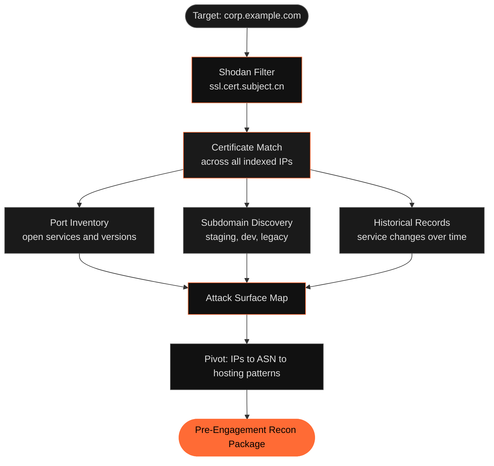
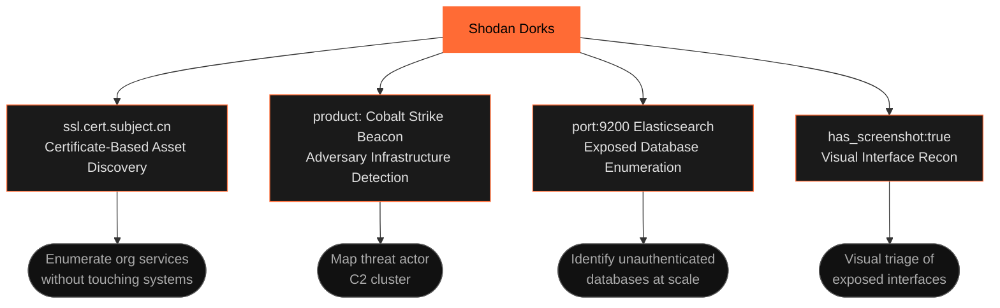

# Shodan

In 2015, security researchers queried Shodan for exposed industrial control systems and found active SCADA interfaces — water treatment facilities, power substations, building automation controllers — sitting on public IPs with no authentication. Some ran firmware from 2003. None of them were supposed to be reachable from the internet. All of them were. The operators did not know.

That is Shodan's defining quality. It shows you what is actually running, not what organizations believe they've exposed.

---

## What It Actually Is

Google crawls what websites choose to show. Shodan records what services actually respond. The distinction is consequential.

Every 24 to 48 hours, Shodan's distributed scanning infrastructure probes billions of IP addresses across every port it can reach. For each address that responds, it captures the banner — the raw response a service sends when contacted. A web server sends HTTP headers. An SSH daemon announces its version and supported ciphers. A database server may expose its authentication status in its greeting. Shodan captures all of it, parses it, enriches it with geolocation and ASN data, and makes it searchable.

This is not a vulnerability scanner. Shodan does not probe for weaknesses or attempt exploitation. It listens to what services say about themselves, which is often damning enough.

```mermaid
graph TD
    subgraph Google["Google — Content-Driven Indexing"]
        G1[Web Server] -->|"publishes intentional content"| G2[Googlebot Crawler]
        G2 -->|"follows links and parses HTML"| G3[Google Search Index]
    end
    subgraph Shodan["Shodan — Service-Driven Indexing"]
        S1[Global Scan Probes] -->|"hits every IP on every port"| S2[Internet]
        S2 -->|"any response is recorded"| S3[Banner and Service Data]
        S3 -->|"enriched and indexed"| S4[Shodan Search Index]
    end

    style G1 fill:#1a1a1a,stroke:#555,color:#e0e0e0
    style G2 fill:#1a1a1a,stroke:#555,color:#e0e0e0
    style G3 fill:#111,stroke:#555,color:#e0e0e0
    style S1 fill:#1a1a1a,stroke:#ff6b35,color:#e0e0e0
    style S2 fill:#1a1a1a,stroke:#ff6b35,color:#e0e0e0
    style S3 fill:#111,stroke:#ff6b35,color:#e0e0e0
    style S4 fill:#ff6b35,stroke:#ff6b35,color:#000
```

A website can request removal from Google's index. You cannot opt a misconfigured Telnet daemon out of Shodan. If it listens, Shodan finds it.

---

## Why It Exists

John Matherly launched Shodan in 2009 with a single goal: give security researchers visibility into the internet's actual attack surface, not the surface as organizations imagined it. What they found was worse than expected. Industrial control systems on public IPs. Medical devices. Routers with default credentials. Database servers with authentication disabled. The scale of unintentionally exposed infrastructure was not a fringe problem — it was systemic.

The tool has since become indispensable across disciplines. Defenders use it to find forgotten assets before attackers do. Threat analysts use it to track adversary infrastructure — command-and-control servers leave persistent fingerprints in Shodan's index. Red teamers use it to build pre-engagement attack surface maps in hours rather than days. Journalists and researchers use it to document exposure at national or sector scale.

The operational principle is the same in every case: the internet is full of services that are exposed without intent and running without oversight. Shodan makes that exposure legible.

---

## How Red Teams and Analysts Use It

For a threat analyst building a profile on a known threat actor, Shodan is often the fastest path to uncovering infrastructure the actor hasn't deliberately hidden. Command-and-control frameworks leave recognizable signatures in service banners, SSL certificates, and default configurations. A query matching the SSL certificate fingerprint of a known C2 server can surface a cluster of additional servers the actor operates — many of them not yet attributed anywhere in public reporting.

For a red team operating under authorized scope against an organization, Shodan compresses passive recon from days into hours. Certificate transparency logs combined with Shodan certificate filters enumerate every externally facing service under an organization's certificate authority chain — including test environments, decommissioned applications, and developer boxes that IT stopped tracking years ago.

The most operationally significant thing Shodan reveals is not what organizations know they've exposed. It's what they forgot.

---

## The Dorks

Shodan's query syntax uses search filters. Practitioners call them dorks — borrowed from Google dorking, the practice of using advanced search operators to surface unintentionally exposed content. The principle is identical: precise filters against indexed data reveal exposure that most people assume isn't visible.

**`ssl.cert.subject.cn:"*.target-corp.com"`**

Returns every service Shodan has indexed that presented an SSL certificate for any subdomain of the target domain. Add `http.status:200` to limit results to live web services, or `port:3389` to find Remote Desktop servers running under the corporate certificate chain. This single filter is the fastest way to enumerate an organization's externally visible infrastructure without touching any of their systems. It works because TLS certificates are served publicly by design — the certificate reveals the subdomain whether or not the subdomain appears in DNS.

**`product:"Cobalt Strike Beacon" port:443`**

Cobalt Strike is a commercial adversary simulation framework that has been widely leaked and is now among the most common command-and-control platforms used by ransomware operators and nation-state actors. When a Cobalt Strike server uses default settings or weak OPSEC, Shodan fingerprints it by service banner characteristics. Threat intelligence teams use this query to locate active C2 infrastructure. Defenders use it to verify their own red team cleaned up after an engagement. It also surfaces previously untracked infrastructure from tracked actors when cross-referenced against known IP ranges or ASNs.

**`port:9200 product:"Elasticsearch" country:"US" org:"Amazon"`**

Elasticsearch databases exposed on port 9200 without authentication have been the source of dozens of major breach disclosures over the past five years — billions of records, most of them never intentionally made public. Narrowing by organization to Amazon Web Services isolates databases running on AWS with misconfigured security groups, which is disproportionately common. This filter does not access any database. It identifies which ones are publicly reachable and how many exist. The numbers are consistently higher than they should be.

**`has_screenshot:true http.title:"Login" port:3389`**

Shodan captures screenshots of HTTP interfaces and RDP login screens during its scanning cycles. This filter returns Remote Desktop services with visible login prompts that are publicly addressable. For red team pre-engagement recon, this identifies machines running RDP on public IPs before any target system is contacted. The `has_screenshot:true` filter generalizes well — applied to other ports and service types, it enables rapid visual triage of exposed interfaces without active probing.

---

## Access and the API

Shodan is not free for serious use. The free tier allows basic searches with limited results. A membership tier ($49/year at time of writing) unlocks full result pagination, API access, and historical banner data. Academic researchers can apply for elevated access at no cost. Enterprise plans add continuous monitoring, alerts, and bulk export.

The API is where Shodan becomes operationally useful. The Python SDK and command-line client enable integration into automated pipelines — monitoring an organization's IP ranges for new services that appear overnight, alerting when a tracked threat actor's certificate fingerprint appears on a new IP, or pulling regular snapshots of an external attack surface for diff-based analysis. A query that takes thirty seconds manually runs unattended and feeds directly into a case management workflow.

---

!!! warning "Querying is not accessing"
    Searching Shodan queries its index of passively observed public data — no target system is contacted. However, acting on what you find is a different matter. Accessing an unauthenticated database, testing credentials against an exposed service, or connecting to a system you do not own or have authorization for is illegal in most jurisdictions regardless of how the exposure occurred. The legal boundary is between passive observation and active interaction. Know where it is before you cross it.

---

For live Shodan analysis, infrastructure tracking walkthroughs, and adversary C2 hunting breakdowns, follow **[@tactical_osint](https://t.me/tactical_osint)** on Telegram.
